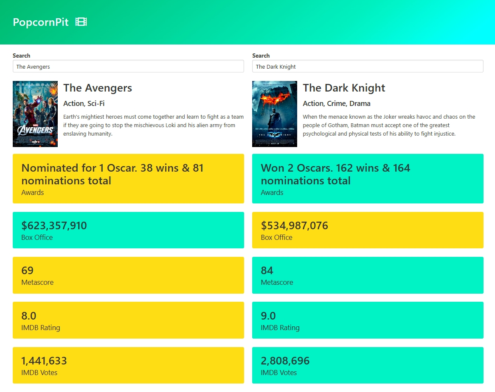

# PopcornPit

PopcornPit is a straightforward application designed to compare the key statistics of two movies and determine a winner. The application utilizes the [OMDb API](https://www.omdbapi.com/) for fetching movie details and relies on the intuitive and responsive UI provided by the [Bulma](https://bulma.io/) CSS framework.

# [Demo](https://timothyguo86.github.io/popcornpit/)

## Overview

PopcornPit allows users to input two movies, retrieves their respective details from the OMDb API using Axios, and compares various statistics such as awards, box office revenue, Metascore, IMDb rating, and IMDb votes. The comparison results help users decide which movie holds the edge in each category.

## Features

- **User-Friendly Interface:** Built with Bulma, PopcornPit boasts an aesthetically pleasing and user-friendly design for a seamless experience.

- **OMDb API Integration with Axios:** The application leverages the OMDb API to gather comprehensive details about the specified movies using the Axios library.

- **Customizable Autocomplete Component:** PopcornPit includes a customizable autocomplete component for an enhanced user input experience.

- **Statistical Comparison:** PopcornPit compares statistics, including awards, box office revenue, Metascore, IMDb rating, and IMDb votes, providing users with a clear winner in each category.

## Technologies Used

- **OMDb API:** The OMDb API serves as the primary data source, offering rich information about movies.

- **Axios:** Axios is used to handle asynchronous HTTP requests to the OMDb API.

- **Bulma:** The Bulma CSS framework is employed to ensure a responsive and visually appealing user interface.

## How to Use

1. Input the names of two movies you'd like to compare.
2. PopcornPit will fetch details from the OMDb API for both movies using Axios.
3. The application will display a side-by-side comparison of the movies' key statistics.
4. Each statistic is color-coded, indicating the winner in that category.

Enjoy comparing your favorite movies with PopcornPit!
